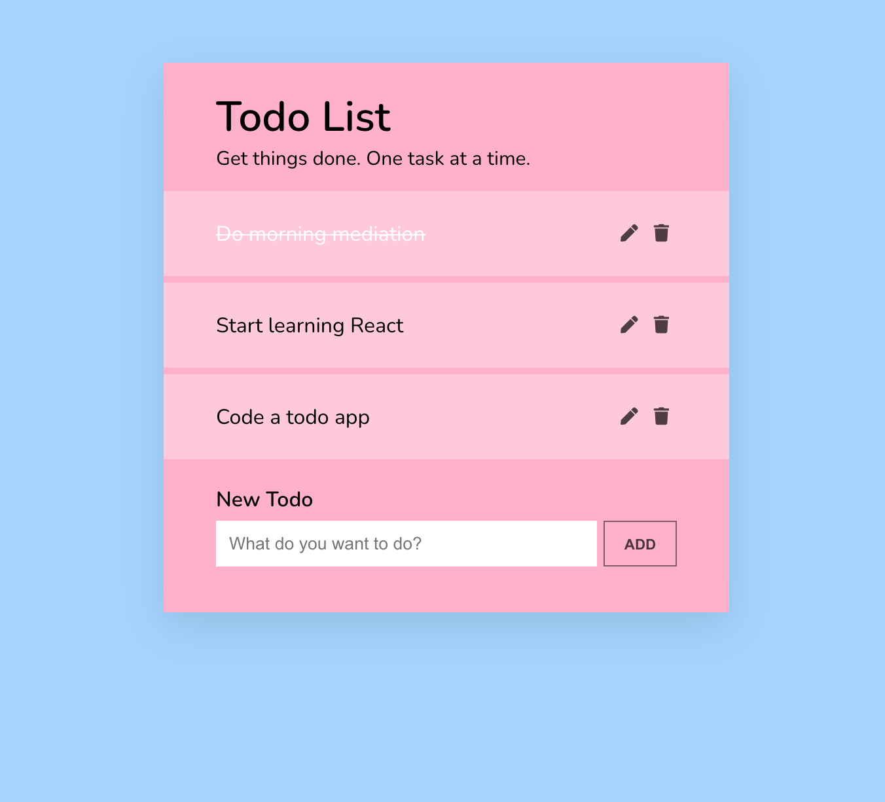

# React Todo App

### Description

This project aims to create a Todo App that allows users to see, add, edit, and remove todos.

It contains the following components:

- App: this component should render the TodoList component

- TodoList: this component should render the NewTodoForm component and should render the list of Todo components. Place your state that contains all of the todos in this component.

- NewTodoForm: this component should render a form with one text input for the task to be created. When this form is submitted, a new Todo component should be created.

- Todo: this component should display a div with the task of the todo. For each Todo component, there should also be a button with the text “X” that when clicked, removes the todo.

It displays an interface that looks like this:

Optional:

- Add a button to mark a todo as completed: strike through the text of the todo.

- Instead of a button, make the todo clickable to mark it as completed. A user can toggle it on and off by clicking.

- Add some styling! E.g. Use a CSS animation that fades out a Todo when it is deleted.

- Save your todos in localStorage and retrieve them when the page loads.

### Technologies

*Languages:* Javascript, HTML, CSS

*Library:* React

### Key features

* List all the todos

* Add a new todo

* Delete a todo

* Edit a todo

### Poject status

The project is done.

### Credits & Sources

* Another small project from [The Modern React Bootcamp](https://www.udemy.com/course/modern-react-bootcamp)
